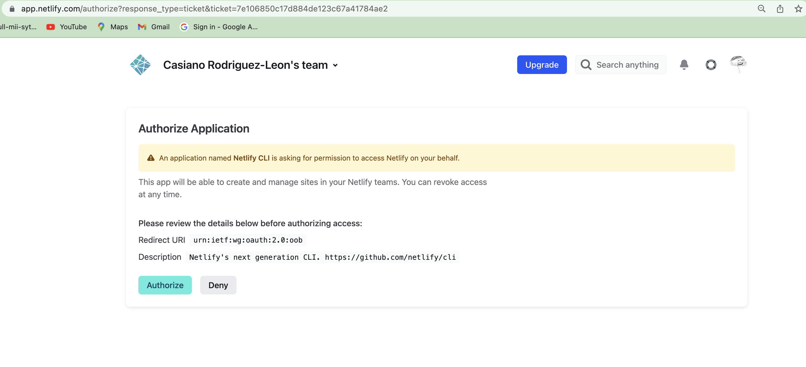
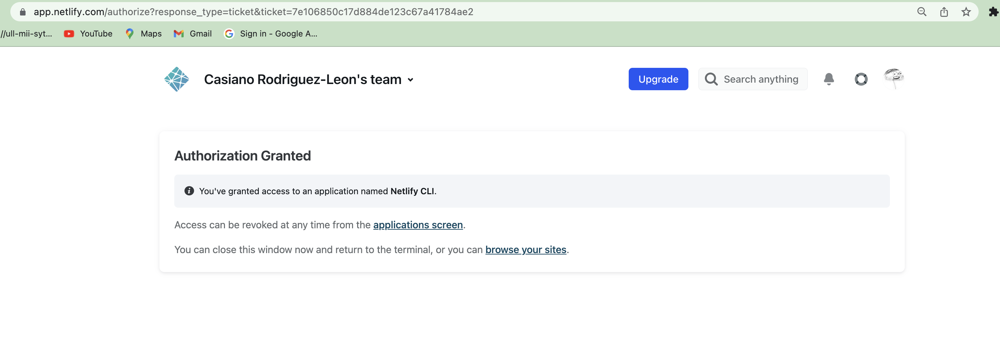
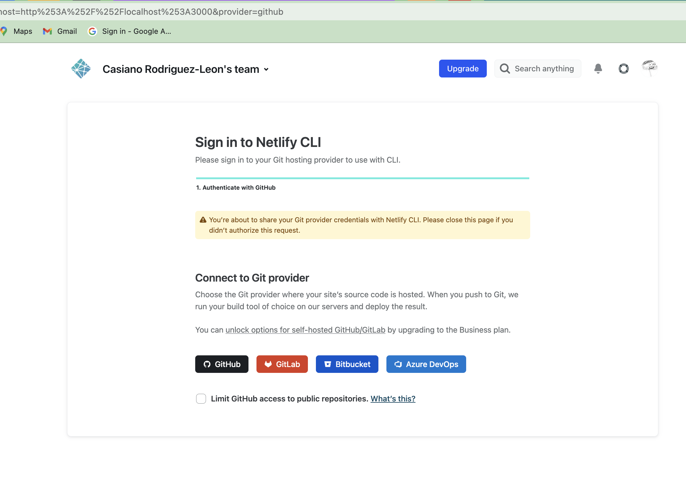
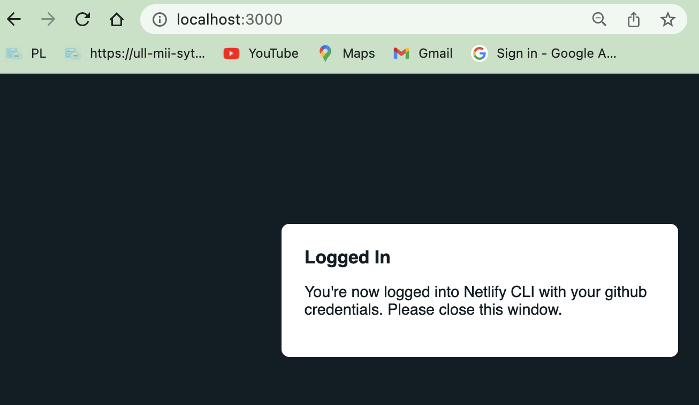
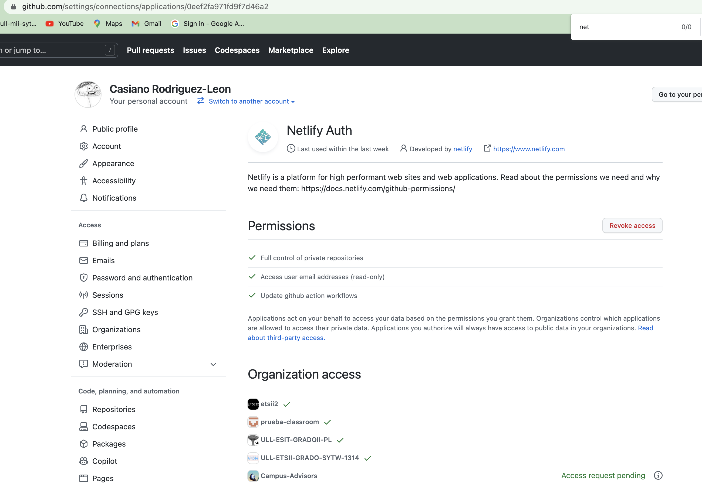
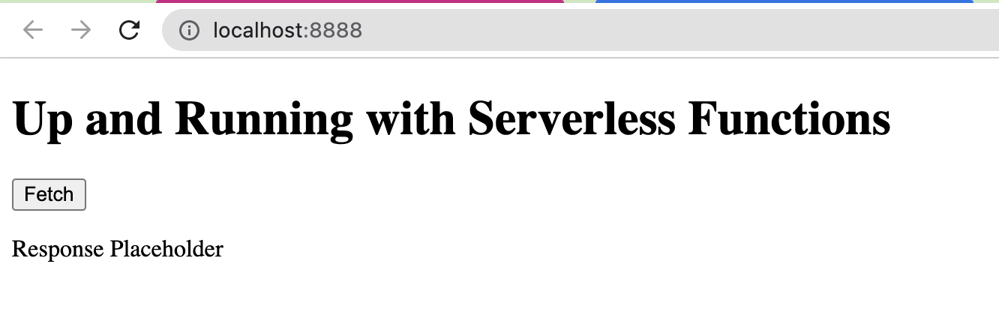
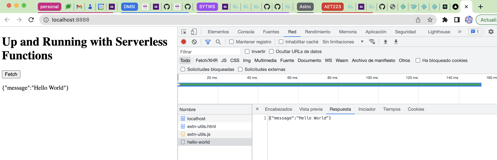

- [Introduction to Netlify Serverless Functions](#introduction-to-netlify-serverless-functions)
  - [The course *Up and Running with Serverless Functions (Jamstack Explorers)*](#the-course-up-and-running-with-serverless-functions-jamstack-explorers)
    - [📚 Resources](#-resources)
    - [Branches in the repo](#branches-in-the-repo)
  - [My Experience](#my-experience)
    - [netlify-cli](#netlify-cli)
    - [ntl cli help](#ntl-cli-help)
    - [ntl login](#ntl-login)
    - [ntl status](#ntl-status)
    - [ntl init](#ntl-init)
    - [But I've got an error](#but-ive-got-an-error)
    - [Edit netlify/functions/hello-world.js](#edit-netlifyfunctionshello-worldjs)
    - [Modify index.html](#modify-indexhtml)
    - [ntl dev](#ntl-dev)
  - [The PokeAPI](#the-pokeapi)

# Introduction to Netlify Serverless Functions

## The course *Up and Running with Serverless Functions (Jamstack Explorers)*

Learn how to use serverless functions in less than 30 minutes!

📼: [Free Video Course](https://explorers.netlify.com/learn/up-and-running-with-serverless-functions/)

### 📚 Resources

| Lesson                                                                                                                                                                                                | Start Branch                                                                                              | End Branch                                                                                              |
| ----------------------------------------------------------------------------------------------------------------------------------------------------------------------------------------------------- | --------------------------------------------------------------------------------------------------------- | ------------------------------------------------------------------------------------------------------- |
| [Introduction with Serverless Functions](https://explorers.netlify.com/learn/up-and-running-with-serverless-functions/introduction-with-serverless-functions)                                         | -                                                                                                         | -                                                                                                       |
| [Project Setup with Serverless Functions](https://explorers.netlify.com/learn/up-and-running-with-serverless-functions/project-setup-with-serverless-functions)                                       | [Start Code](https://github.com/netlify/explorers-up-and-running-with-serverless-functions/tree/02-begin) | [End Code](https://github.com/netlify/explorers-up-and-running-with-serverless-functions/tree/02-end)   |
| [Create Your First Serverless Function](https://explorers.netlify.com/learn/up-and-running-with-serverless-functions/create-your-first-serverless-function)                                           | [Start Code](https://github.com/netlify/explorers-up-and-running-with-serverless-functions/tree/03-begin) | [End Code](https://github.com/netlify/explorers-up-and-running-with-serverless-functions/tree/03-end)   |
| [Integrate with a Third Party API with Serverless Functions](https://explorers.netlify.com/learn/up-and-running-with-serverless-functions/integrate-with-a-third-party-api-with-serverless-functions) | [Start Code](https://github.com/netlify/explorers-up-and-running-with-serverless-functions/tree/04-begin) | [End Code](https://github.com/netlify/explorers-up-and-running-with-serverless-functions/tree/04-end) |
| [Deploying Serverless Functions](https://explorers.netlify.com/learn/up-and-running-with-serverless-functions/deploying-serverless-functions)                                                         | -                                                                                                         | -                                                                                                       |
| [Customizing the Request with Serverless Functions](https://explorers.netlify.com/learn/up-and-running-with-serverless-functions/customizing-the-request-with-serverless-functions)                   | [Start Code](https://github.com/netlify/explorers-up-and-running-with-serverless-functions/tree/06-begin) | [End Code](https://github.com/netlify/explorers-up-and-running-with-serverless-functions/tree/06-end)   |
| [The Power of Atomic Serverless Functions](https://explorers.netlify.com/learn/up-and-running-with-serverless-functions/the-power-of-atomic-serverless-functions)                                     | -                                                                                                         | -                                                                                                       |
| [Next Steps with Serverless Functions](https://explorers.netlify.com/learn/up-and-running-with-serverless-functions/next-steps-with-serverless-functions)                                             | -                                                                                                         | -                                                                                                       |

### Branches in the repo

We can follow the lessons in the video course by checking out the branches in this repo.

```bash
* main
  remotes/up/02-begin
  remotes/up/02-end
  remotes/up/03-begin
  remotes/up/03-end
  remotes/up/04-begin
  remotes/up/04-end
  remotes/up/06-begin
  remotes/up/06-end
  remotes/up/HEAD -> up/main
  remotes/up/chore/fossa-workflow-fix-20210820
  remotes/up/main
  remotes/up/renovate/configure
```

## My Experience


### netlify-cli

See the videos up to [Create Your First Serverless Function](https://explorers.netlify.com/learn/up-and-running-with-serverless-functions/create-your-first-serverless-function)  

The tutoral installs `3.31.14`, but I have `12.2.8` installed.

```
➜  explorers-up-and-running-with-serverless-functions git:(main) npm install netlify-cli -g
added 1438 packages, and audited 1439 packages in 26s
➜  explorers-up-and-running-with-serverless-functions git:(main) npm ls -g netlify-cli
/Users/casianorodriguezleon/.nvm/versions/node/v16.0.0/lib
└── netlify-cli@12.2.8
➜  explorers-up-and-running-with-serverless-functions git:(main) ✗ ntl --version
netlify-cli/12.2.8 darwin-x64 node-v16.0.0
➜  explorers-up-and-running-with-serverless-functions git:(main) ✗ node --version
v16.0.0
```

### ntl cli help

```
➜  explorers-up-and-running-with-serverless-functions git:(main) ✗ ntl --help
VERSION
  netlify-cli/12.2.8 darwin-x64 node-v16.0.0

USAGE
  $ netlify [COMMAND]

COMMANDS
  $ addons       (Beta) Manage Netlify Add-ons
  $ api          Run any Netlify API method
  $ build        (Beta) Build on your local machine
  $ completion   (Beta) Generate shell completion script
  $ deploy       Create a new deploy from the contents of a folder
  $ dev          Local dev server
  $ env          Control environment variables for the current site
  $ functions    Manage netlify functions
  $ recipes      (Beta) Create and modify files in a project using pre-defined
                 recipes
  $ graph        (Beta) Control the Netlify Graph functions for the current
                 site
  $ init         Configure continuous deployment for a new or existing site. To
                 create a new site without continuous deployment, use `netlify sites:create`
  $ link         Link a local repo or project folder to an existing site on
                 Netlify
  $ lm           Handle Netlify Large Media operations
  $ login        Login to your Netlify account
  $ open         Open settings for the site linked to the current folder
  $ sites        Handle various site operations
  $ status       Print status information
  $ switch       Switch your active Netlify account
  $ unlink       Unlink a local folder from a Netlify site
  $ watch        Watch for site deploy to finish
```

### ntl login

``` 
➜  explorers-up-and-running-with-serverless-functions git:(main) ✗ ntl login -h      
Login to your Netlify account

USAGE
  $ netlify login [options]

OPTIONS
  -h, --help                                display help for command
  --new                                     Login to new Netlify account
  --debug                                   Print debugging information
  --httpProxy [address]                     Proxy server address to route requests through.
  --httpProxyCertificateFilename [file]     Certificate file to use when connecting using a proxy
                                            server

DESCRIPTION
  Opens a web browser to acquire an OAuth token.
➜  explorers-up-and-running-with-serverless-functions git:(main) ✗ ntl login
Logging into your Netlify account...
Opening https://app.netlify.com/authorize?response_type=ticket&ticket=7e106850c17d884de123c67a41784ae2
```

AS the help says, it opens a web browser to acquire an OAuth token



Once I've had clicked `Authorize` I've got the following message:



Now in the terminal appears:

```
➜  explorers-up-and-running-with-serverless-functions git:(main) ✗ ntl login
Logging into your Netlify account...
Opening https://app.netlify.com/authorize?response_type=ticket&ticket=7e106850c17d884de123c67a41784ae2

You are now logged into your Netlify account!

Run netlify status for account details

To see all available commands run: netlify help
```

### ntl status

```
➜  explorers-up-and-running-with-serverless-functions git:(main) ntl status
──────────────────────┐
 Current Netlify User │
──────────────────────┘
Name:  Casiano Rodriguez-Leon
Email: xxxx@ull.edu.es
Teams: 
  Casiano Rodriguez-Leon's team: Collaborator
 ›   Warning: Did you run `netlify link` yet?
 ›   Error: You don't appear to be in a folder that is linked to a site
```

### ntl init

```
➜  explorers-up-and-running-with-serverless-functions git:(main) ✗ ntl init

Adding local .netlify folder to .gitignore file...
? What would you like to do? +  Create & configure a new site
? Team: Casiano Rodriguez-Leon's team
? Site name (leave blank for a random name; you can change it later): netlify-serverless-functions-intro

Site Created

Admin URL: https://app.netlify.com/sites/netlify-serverless-functions-intro
URL:       https://netlify-serverless-functions-intro.netlify.app
Site ID:   XXXXXXX-XXXX-XXXXX-XXXX-YYYYYYYYYYY

Linked to netlify-serverless-functions-intro


? Netlify CLI needs access to your GitHub account to configure Webhooks and Deploy Keys. What would you like to do? Authorize with GitHub through app.netlify.com
```

I've chosen to authorize with GitHub through app.netlify.com



and now I'm logged in netlify-cli with my GitHub credentials:



Then I continue answering the questions:

```
? Your build command (hugo build/yarn run build/etc): # no build command
? Directory to deploy (blank for current dir): public
? No netlify.toml detected. Would you like to create one with these build settings? Yes
```

### But I've got an error

```
Adding deploy key to repository...
 ›   Error: Failed adding GitHub deploy key with error: Not Found. Does the repository netlify-serverless-functions-intro-solution exist and do ULL-MII-SYTWS has the correct permissions to set up deploy keys?
```

Since the repository `netlify-serverless-functions-intro-solution`  exists there must be a problem with the permissions?. 

So I went to GH config oauth apps and change the permits for the netlify-cli Oauth app:



and switched to grant:


Let us see the status:

```
➜  explorers-up-and-running-with-serverless-functions git:(main) ✗ ntl status
──────────────────────┐
 Current Netlify User │
──────────────────────┘
Name:   Casiano Rodriguez-Leon
Email:  crguezl@ull.edu.es
GitHub: crguezl
Teams:
  Casiano Rodriguez-Leon's team: Collaborator
────────────────────┐
 Netlify Site Info  │
────────────────────┘
Current site: netlify-serverless-functions-intro
Netlify TOML: /Users/casianorodriguezleon/campus-virtual/2223/learning/serverless-learning/explorers-up-and-running-with-serverless-functions/netlify.toml
Admin URL:    https://app.netlify.com/sites/netlify-serverless-functions-intro
Site URL:     https://netlify-serverless-functions-intro.netlify.app
Site Id:      
```

so I tried to use the `link` command to link the project to the Netlify site:

```
➜  explorers-up-and-running-with-serverless-functions git:(main) ✗ ntl link --gitRemoteName origin --debug

❯ Initial build environment
cwd: /Users/casianorodriguezleon/campus-virtual/2223/learning/serverless-learning/explorers-up-and-running-with-serverless-functions
featureFlags: []
mode: cli
siteId: 

❯ UI build settings
baseRelDir: false

❯ Resolved build environment
branch: main
buildDir: /Users/casianorodriguezleon/campus-virtual/2223/learning/serverless-learning/explorers-up-and-running-with-serverless-functions
configPath: /Users/casianorodriguezleon/campus-virtual/2223/learning/serverless-learning/explorers-up-and-running-with-serverless-functions/netlify.toml
context: production
env:
  - DEPLOY_ID
  - BUILD_ID
  - NETLIFY_LOCAL
  - HEAD
  - COMMIT_REF
  - CACHED_COMMIT_REF
  - PULL_REQUEST
  - LANG
  - LANGUAGE
  - LC_ALL
  - GATSBY_TELEMETRY_DISABLED
  - NEXT_TELEMETRY_DISABLED

❯ Resolved config
build:
  command: '# no build command'
  commandOrigin: config
  publish: /Users/casianorodriguezleon/campus-virtual/2223/learning/serverless-learning/explorers-up-and-running-with-serverless-functions/public
  publishOrigin: config
functionsDirectory: /Users/casianorodriguezleon/campus-virtual/2223/learning/serverless-learning/explorers-up-and-running-with-serverless-functions/netlify/functions
Site already linked to "netlify-serverless-functions-intro"
Admin url: https://app.netlify.com/sites/netlify-serverless-functions-intro

To unlink this site, run: netlify unlink
```

### Edit netlify/functions/hello-world.js

```js
exports.handler = async (event, context) => {
  return {
    statusCode: 200,
    body: JSON.stringify({ message: 'Hello World' })
  }
}
```

### Modify index.html

```html
<script>
 <script>
  document.addEventListener('DOMContentLoaded', () => {
    const fetchBtn = document.getElementById('fetch-btn')
    const responseText = document.getElementById('response-output')

    fetchBtn.addEventListener('click', async () => {
      const response = await fetch('/.netlify/functions/hello-world').then(r => r.json())
      responseText.innerText = JSON.stringify(response)
    })
  })
</script>
```

### ntl dev 

```
➜  explorers-up-and-running-with-serverless-functions git:(main) ✗ ntl dev
◈ Netlify Dev ◈
◈ Ignored general context env var: LANG (defined in process)
◈ No app server detected. Using simple static server
◈ Running static server from "explorers-up-and-running-with-serverless-functions/public"
◈ Loaded function hello-world http://localhost:8888/.netlify/functions/hello-world.
◈ Functions server is listening on 51227
◈ Setting up local development server

────────────────────────────────────────────────────────────────
  Netlify Build                                                 
────────────────────────────────────────────────────────────────

❯ Version
  @netlify/build 28.4.5

❯ Flags
  {}

❯ Current directory
  /Users/casianorodriguezleon/campus-virtual/2223/learning/serverless-learning/explorers-up-and-running-with-serverless-functions

❯ Config file
  /Users/casianorodriguezleon/campus-virtual/2223/learning/serverless-learning/explorers-up-and-running-with-serverless-functions/netlify.toml

❯ Context
  dev

────────────────────────────────────────────────────────────────
  1. Run command for local development                          
────────────────────────────────────────────────────────────────


◈ Static server listening to 3999

(dev.command completed in 7ms)

   ┌─────────────────────────────────────────────────┐
   │                                                 │
   │   ◈ Server now ready on http://localhost:8888   │
   │                                                 │
   └─────────────────────────────────────────────────┘

✔ Setting up the Edge Functions environment. This may take a couple of minutes.
```

Now we visit <http://localhost:8888>:



When we click in the **fetch** button we get:



## The PokeAPI

Now watch the video  [Integrate with a Third Party API with Serverless Functions](https://explorers.netlify.com/learn/wup-and-running-with-serverless-functions/integrate-with-a-third-party-api-with-serverless-functions) and follow the instructions

We are going to use the [PokeAPI](https://pokeapi.co/)

* [PokeAPI web site]/(https://pokeapi.co/)
* [REST PokeAPI](https://pokeapi.co.api/v2/)
* [GraphQL PokeAPI](https://beta.pokeapi.co/graphql/console/)
* [docs](https://pokeapi.co/docs/v2)

The fetch API is included in node v18 or later. If you are using an older version of node, we use the [node-fetch](https://www.npmjs.com/package/node-fetch) package.

